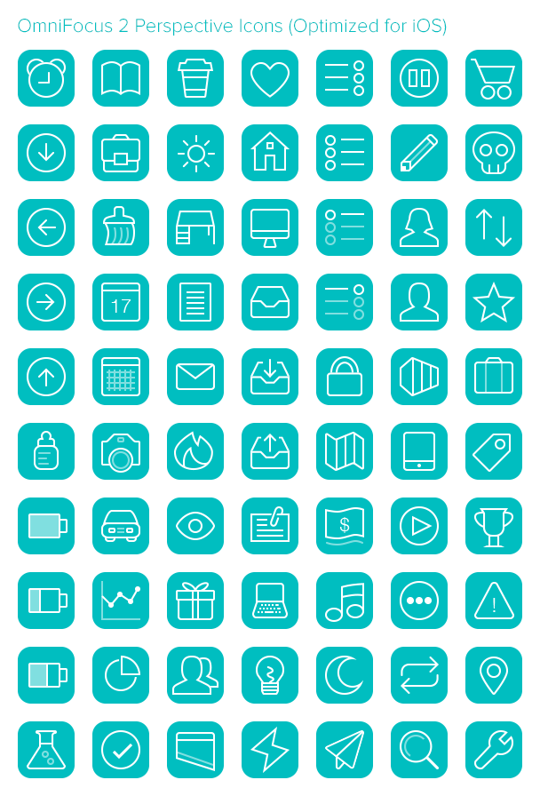
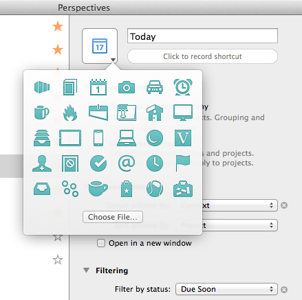

# OmniFocus 2 Perspective Icons

By [Josh Hughes](http://josh-hughes.com)

**Note: This requires the Professional version of OmniFocus 2 for Mac**

I've developed a set of icons that is specifically designed to work well with The Omni Group's OmniFocus 2 software. Feel free to use these icons for whatever you like.

All of the production-ready icons are all in the `dist` folder.  The `src` folder contains PSDs and vector artwork for all of the icons.

**[Download the Icons](https://github.com/deaghean/omnifocus-perspective-icons/archive/master.zip)**

## For Mac

For the Mac, each glyph has a file, starting with `icon-`, for each of the following colors: blue, brown, graphite, green, orange, purple, red, and teal. There are also Retina display @2x variations.

## For iOS

In addition, I've also created versions of these icons that fit in well on the universal iOS application, and work well with the soon-to-be-available "dark mode". These start with `icon-ios-`, and have the same color and Retina display variations as the Mac (though, the teal color tends to work best).

**[View Enlarged Screenshot](screenshots/ios-full.png)**

*Note:* You have to set up the perspective on the Mac version to use this, and unfortunately it doesn't work well as a Mac icon. The best solution right now is to create two perspectives, one for the Mac, and one for iOS that use different icons.

## Installation

1. In the Menu, go to **Perspectives** > **Show Perspectives**
2. Click on the Perspective you want to edit the icon for. (Note that Inbox, Projects, Contexts, Forecast, Flagged, and Review all cannot be changed).
3. Select the icon you want to use. The `dist` folder has all the usable icons. There's a folder for each one which contains files for the 8 colors, the iOS version, and the @2x variations. You should only use the @2x versions if you have a Retina Display Mac or a Retina iOS device.
4. Drag the icon you want to the icon well in the Perspectives window, or click the down arrow on the icon, and then Choose File, and navigate to the icon.

Feedback and suggestions are welcome. I can be reached at [josh@josh-hughes.com](mailto:josh@josh-hughes.com).