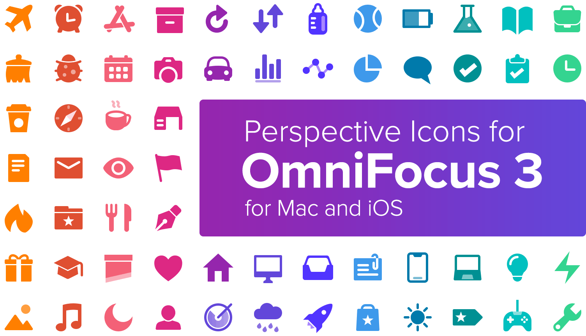

# OmniFocus Perspective Icons

By [Josh Hughes](http://josh-hughes.com)

**Note: Using these icons requires the Professional version of OmniFocus 3 for Mac or iOS or OmniFocus 2 for Mac**

I've developed a set of icons that is specifically designed to work well with The Omni Group's OmniFocus software. Feel free to use these icons for whatever you like. I recommend using the [website for this project](https://omnifocusicons.josh-hughes.com) to install the icons. It's easier than navigating the folder structure here.

The OmniFocus 3 icons are all in the `v3` folder, while the OmniFocus 2 icons are in the `v2` folder. The `src` folder contains PSDs and vector artwork for all of the icons.

**[Download the Icons](https://github.com/deaghean/omnifocus-perspective-icons/archive/master.zip)**

Feedback and suggestions are welcome, and I'm happy to answer any questions. I can be reached at [josh@josh-hughes.com](mailto:josh@josh-hughes.com).