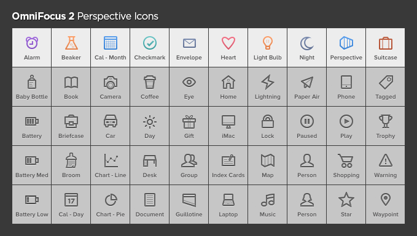

# OmniFocus 2 Perspective Icons

By Josh Hughes

**Note: This requires the Professional version of OmniFocus 2**

I've developed a set of icons that is specifically designed to work well with The Omni Group's OmniFocus 2 for Mac software. Feel free to use these icons for whatever you like.

The production-ready icons are all in the `dist` folder. Each glyph has a file for each of the following colors: blue, brown, graphite, orange, purple, red, and teal. There are also Retina display @2x variations.

The `src` folder contains PSDs of all the icons.

**[Download the Icons](https://github.com/deaghean/omnifocus-perspective-icons/archive/master.zip)**

## Installation

1. In the Menu, go to **Perspectives** > **Show Perspectives**
2. Click on the Perspective you want to edit the icon for. (Note that Inbox, Projects, Contexts, Forecast, Flagged, and Review all cannot be changed).
3. Select the icon you want to use. The `dist` folder has all the usable icons. There's a folder for each one which contains files for the 7 colors, and the @2x variations. You should only use the @2x versions if you have a Retina Display Mac.
4. Drag the icon you want to the icon well in the Perspectives window, or click the down arrow on the icon, and then Choose File, and navigate to the icon.

Feedback and suggestions are welcome. I can be reached at [josh@josh-hughes.com](mailto:josh@josh-hughes.com).